Classification of Species using NeuroMorpho Data
================================================

This analysis is concerned with the classification of species type. Data from [NeuroMorpho.org](http://www.neuromorpho.org) as well as
[L-measure functions](http://cng.gmu.edu:8080/Lm/help/index.htm) were
used to obtain both qualitative and quantitative measurements from
neuronal reconstructions (the predictors). The computer program `R` is
used for statistical analysis.

    master <- read.csv("NeuronDataMaster.csv", header = T)
    dim(master) #this table has 18,374 observations and 160 variables

    ## [1] 18734   160

    master <- master[,-c(83,84,85)] #these columns contain many NA

Predictor Correlations
======================

Variable types in this dataset include both numeric and categorical. If
the numeric variables are to be used as predictors, it is important to
check the correlation or collinearity amongst the predictors.

    #Some variables need to be properly defined. 
    master$Fractal_Dim<- as.numeric(master$Fractal_Dim) 
    master$Soma.Surface<-as.numeric(master$Soma.Surface)
    #remove some remaining observations with NA
    isna <- is.na(master$Diameter_pow)
    nas <- which(isna == TRUE)
    master <- master[-nas,]
    #Find correlations among numeric variables (not including gstats)
    cors <- cor(master[,33:93])
    cormat <- as.matrix(cors)
    colnames(cormat) <- NULL
    #find which correlations are very high
    high_cors <- which(cormat > 0.98, arr.ind = T)
    dim(high_cors)

    ## [1] 225   2

There are 225 instances of a very high positive correlation. Some are
just because the correlation matrix includes the correlation of a
variable with itself, which is always +1. Let's remove them.

    same <- which(high_cors[,1] == high_cors[,2])
    high_cors2 <- high_cors[-same,]
    dim(high_cors2)

    ## [1] 164   2

Now, these 164 instances indicate that there may be duplicates or
perhaps linear combinations of variables. A quick investigation of the
variable names shows that there are a few duplicates.

    unique(rownames(high_cors2))

    ##  [1] "Soma_Surface"           "N_stems"               
    ##  [3] "Number.of.Branches"     "N_bifs"                
    ##  [5] "N_branch"               "N_tips"                
    ##  [7] "Contraction"            "Parent_Daughter_Ratio" 
    ##  [9] "Bif_ampl_local"         "Bif_ampl_remote"       
    ## [11] "Bif_tilt_local"         "Bif_tilt_remote"       
    ## [13] "Bif_torque_local"       "Bif_torque_remote"     
    ## [15] "Number.of.Bifurcations" "Length"                
    ## [17] "Branch_pathlength"      "Surface"               
    ## [19] "Fragmentation"          "Soma.Surface"          
    ## [21] "Number.of.Stems"        "TerminalSegment"       
    ## [23] "Total.Length"           "Total.Surface"         
    ## [25] "Type"                   "Partition_asymmetry"   
    ## [27] "Total.Fragmentation"

Variables such as
`Number.of.Stems, Number.of.Bifurcations, Fragmentation, Soma.Surface`,
etc. have duplicates. Also,
`Number.of.Branches = Number.of.Stems + 2*Number.of.Bifurcations`, so it
is a linear combination and does not give any new information. For now,
highly correlated angle measurements such as `bif_ampl_remote` will be
removed.

According to the [L-measure help page](http://cng.gmu.edu:8080/Lm/help/index.htm) , the variable `Type`
is defined to return type of compartment, with options being soma = 1,
axon = 2, basal dendrites = 3, and apical dendrites = 4. This is
technically a categorical variable and should be defined as such in `R`.
However:

    class(master$Type) #it was read in as a number

    ## [1] "integer"

    c(mean(master$Type), max(master$Type)) #much larger than 4

    ## [1]   6844.154 261941.000

When looking at the SWC file, the L-measure function is taking the sum
of all the labels. Therefore, `Type` is also being removed for
statistical purposes.

From previous work done on this data, random forests were used in order
to classify the species type of the neuron.

Random Forest Analysis
======================

First, a quick introduction to the random forest classification technique (
[citation](http://onlinelibrary.wiley.com/doi/10.1002/cem.1233/epdf)
).
In statistics, decision tree
classifiers determine "cut-off" points in predictors, and group the
observations accordingly. A sequential algorithm is used to construct
this tree. Optimal tree size is determined through a method called
cross-validation. The issue with using a single tree is that its
prediction will have a high variance and a moderate amount of bias. The
bias means that even small changes to the data can significantly alter
the construction of the tree, which, in turn, will affect the
classification accuracy.

Building a group of trees (forest), however, improves the classification
accuracy and lowers the variance. By applying a random selection
mechanism to the data (both to the observations andthe features), many
randomly sampled, alternative data sets are created. In the end, each
observation is predicted by each tree in the forest and the predicted
label corresponds to the majority class. The averaging of many tree
classifiers in a random forest allows the procedure to reduce variance
of the existing forest, relative to any single tree in it (a fact due to
the strong law of large numbers). Further, it has been shown that
constructing trees of maximum sizes leads to reductions in bias.
Therefore, generating a forest from several large random trees achieves
both simultaneous bias and variance reduction (relative to a single
tree).

Although the random forest technique deals very well with correlated
predictor variables, it is still better to remove them (I would like to
try multinomial regression with this data). Now, we will proceed using
only neurons exhibiting a secondary cell class of `pyramidal`.

    pyramid <- read.csv("pyramidal_appended.csv", header = T)
    #same thing need to properly define variables
    pyramid$Fractal_Dim <- as.numeric(pyramid$Fractal_Dim)
    pyramid$Soma.Surface<-as.numeric(pyramid$Soma.Surface)
    #a look at the predictors we are removing
    colnames(pyramid)[c(36,54,55,56,57,62,65,66,76,78, 83:91)]

    ##  [1] "Number.of.Branches" "Soma_Surface"       "N_stems"           
    ##  [4] "N_bifs"             "N_branch"           "Type"              
    ##  [7] "Length"             "Surface"            "Branch_pathlength" 
    ## [10] "Fragmentation"      "Pk"                 "Pk_classic"        
    ## [13] "Pk_2"               "Bif_ampl_local"     "Bif_ampl_remote"   
    ## [16] "Bif_tilt_local"     "Bif_tilt_remote"    "Bif_torque_local"  
    ## [19] "Bif_torque_remote"

    pyramid1 <- pyramid[,-c(36,54,55,56,57,62,65,66,76,78, 83:91)]
    #now split X into 2 subsets
    nx1 <- 33:77 #predictors of interest for now
    nx2 <- 78:dim(pyramid1)[2] #gstats (will NOT be used yet)
    ny <- 4
    #make an easier data frame for random forests to deal with
    dat <- data.frame(y=as.factor(pyramid1[,ny]),pyramid1[,nx1])
    dat <- na.omit(dat)
    #run a random forest classification
    set.seed(100)
    #model
    g1<-randomForest(y~.,data=dat)##,prox=TRUE)

The model is ready, now for some plots:

    cols <- rainbow(length(unique(dat[,1]))+2)
    matplot(g1$err.rate,lwd=2,col=cols,lty=1,type="l", main = "Species Error Rate", ylab = "Error rate", xlab = "Number of Trees")

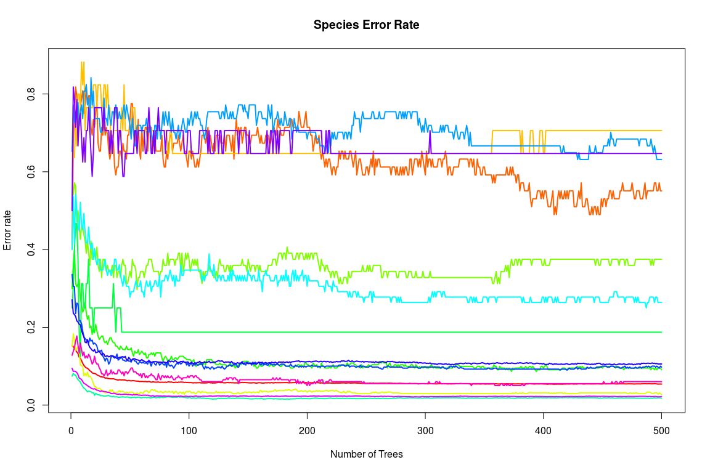

The random forest classifies some species very well but struggles with
others (more on this in a little). Random forests are also useful for
variable importance.

    #variable importance
    varImpPlot(g1, pch = 16, main = "Variable Importance")

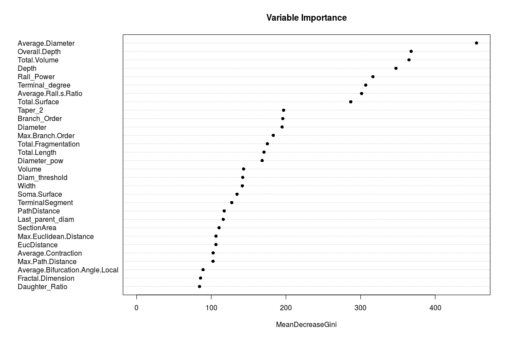

The most important variables seem to be
`Average.Diameter, Overall.Depth, Total.Volume, Depth, Rall_Power, Terminal.Degree, and Average.Rall.s.Ratio`.
The relationship between `Depth` and `Overall.Depth` will be examined.

    #errors
    sort(g1$confusion[,15])

    ##              human                rat         chimpanzee 
    ##         0.01779173         0.02212389         0.02755906 
    ##              sheep            giraffe             monkey 
    ##         0.06030151         0.09090909         0.09768638 
    ##              mouse         guinea pig     humpback whale 
    ##         0.10569106         0.18750000         0.26388889 
    ##           elephant bottlenose dolphin        minke whale 
    ##         0.37500000         0.55102041         0.63157895 
    ##         proechimys                cat 
    ##         0.64705882         0.70588235

    #overall testing error
    g1$err.rate[500,1]

    ##        OOB 
    ## 0.05397849

Relationship between `Species` and `Average.Diameter`
=====================================================

The above table just gives the final error rate for each species.
Overall, there is a testing error of about 5.4 percent. With
`Average.Diameter` scoring as the "most important" variable, let us look
at some boxplots of this variable and compare the distribution between
all species types.
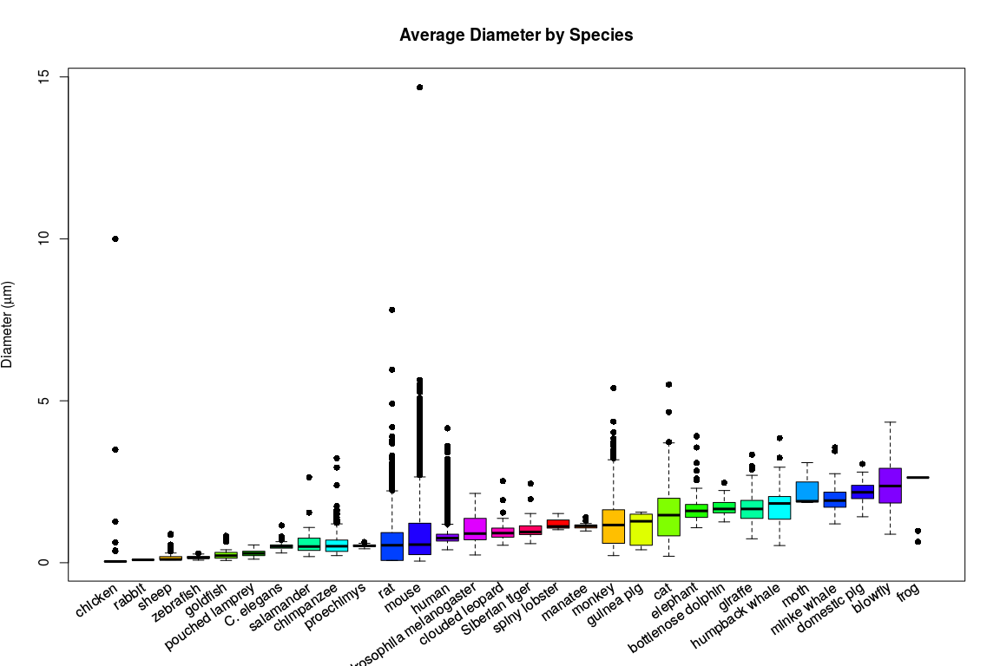

Due to the outliers, this was interesting. I'm not sure if these outlier
rat and chicken neurons are just that much larger than any others, or if
it is an error in the L-measure computations. Anyway, since our analysis
is restricted to pyramidal cells at the moment, let us recreate this
boxplot to account for that.

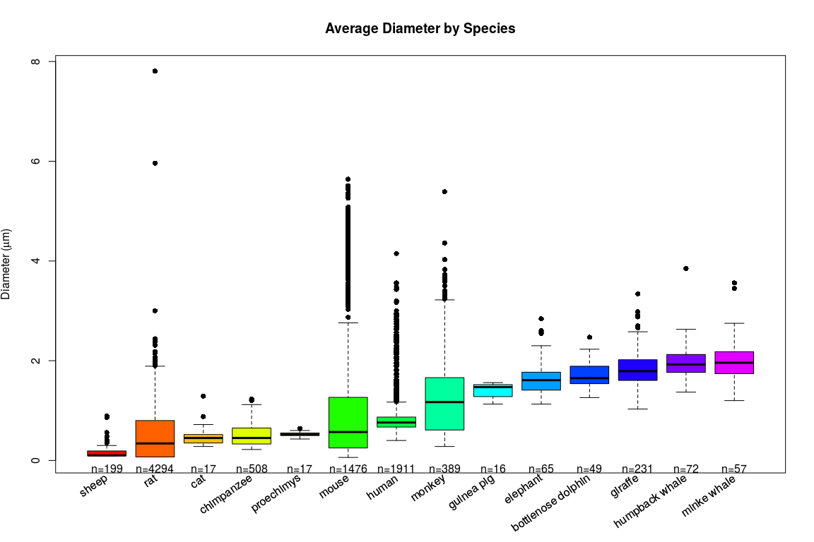
Again, some rats have much larger neurons. These outlier observations
are certainly candidates to be removed, but for now, they will remain a
part of the analysis.

Back to Random Forest
=====================

    #run g1 random forest from pyramid.R
    #make an easy to view table 
    cbind(summary(pyramid1[,4]), g1$confusion[,15], medians) -> ex
    colnames(ex)[3] <- "Avg. Diameter"
    colnames(ex)[2] <- "Prediction Error"
    colnames(ex)[1] <- "n"
    ex[order(ex[,2]),] 

    ##                       n Prediction Error Avg. Diameter
    ## human              1911       0.01779173         0.760
    ## rat                4294       0.02212389         0.340
    ## chimpanzee          508       0.02755906         0.450
    ## sheep               199       0.06030151         0.100
    ## giraffe             231       0.09090909         1.790
    ## monkey              389       0.09768638         1.170
    ## mouse              1476       0.10569106         0.570
    ## guinea pig           16       0.18750000         1.470
    ## humpback whale       72       0.26388889         1.925
    ## elephant             65       0.37500000         1.610
    ## bottlenose dolphin   49       0.55102041         1.650
    ## minke whale          57       0.63157895         1.960
    ## proechimys           17       0.64705882         0.520
    ## cat                  17       0.70588235         0.450

The higher error rates seem to have a lower sample size (guinea pig) and
very similar median average diameters. Since this is (so far) the most
important variable, the classifier may be confusing minke whale with
humpback whale, as well as cat and proechimys with rats, chimps, and
mice. So, I remove these observations.

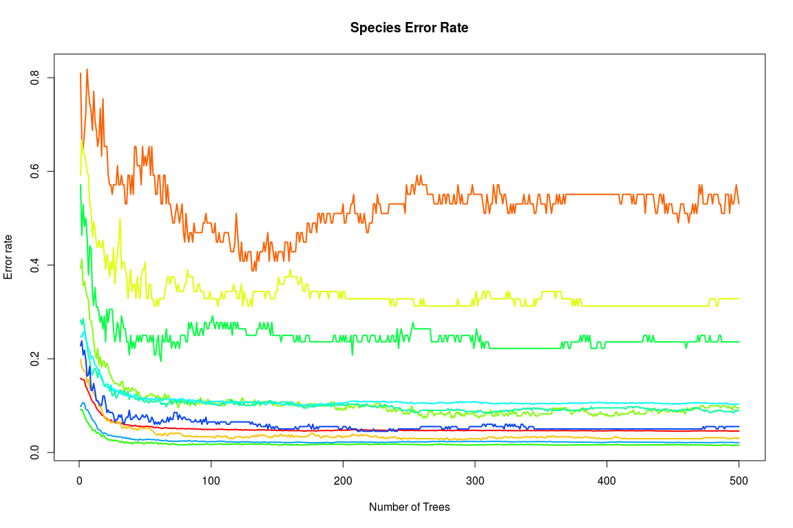

    ##              human                rat         chimpanzee 
    ##         0.01569859         0.02095948         0.02952756 
    ##              sheep             monkey            giraffe 
    ##         0.05527638         0.08997429         0.09523810 
    ##              mouse     humpback whale           elephant 
    ##         0.10298103         0.23611111         0.32812500 
    ## bottlenose dolphin 
    ##         0.53061224

Now, specific species, such as humpback whale, improved tremendously.
Variable importance has not changed.

To compare improvement, below is a plot that compares the overall
testing error before removing variables, after removal of redundant
variables, and after removal of redundant variables as well as species
with a small sample size:

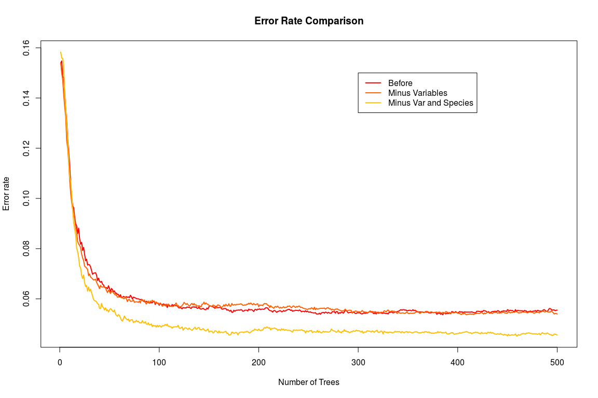

One Final Variable Relationship
===============================

Referring back to the Variable Importance Plot, the variables `Depth`
and `Overall.Depth` have an interesting relationship. Check out the plot
below: 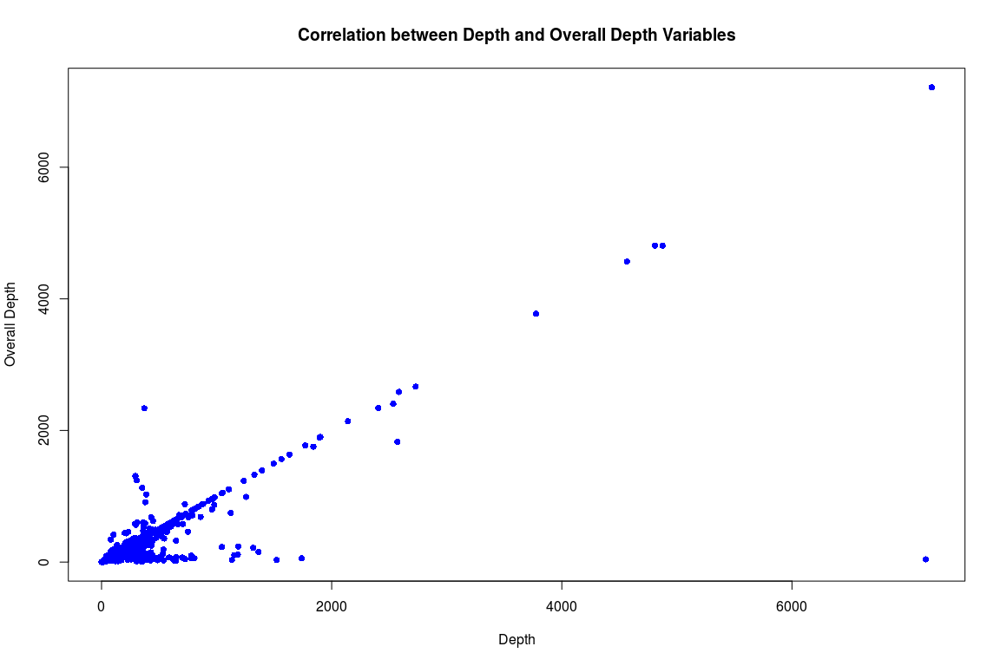 The plot
would like to exhibit a strong positive correlation, but there seems to
be a lot of noise in the bottom left portion.

    #finding discrepancies between Depth and Overall Depth variables
    collect <- vector(length=dim(pyramid)[1])
    for(i in 1:dim(pyramid)[1])
    collect[i] <- sum(pyramid[i,39] != pyramid[i,61])
    diffs <- pyramid[which(collect == 1), 39] - pyramid[which(collect == 1), 61]
    #how big are largest discrepancies?
    tail(sort(abs(diffs)))

    ## [1] 1103.70 1211.70 1489.81 1683.81 1965.10 7120.01

    #max difference is more than 7000 square microns
    #look more closely at these observations
    pyramid[which(collect == 1)[tail(order(abs(diffs)))], c(4,39,61)]

    ##      Species.Name Overall.Depth   Depth
    ## 739           rat        215.11 1318.81
    ## 738           rat        153.16 1364.86
    ## 4318        mouse         32.45 1522.26
    ## 4321        mouse         56.39 1740.20
    ## 8915          rat       2336.25  371.15
    ## 4317        mouse         42.59 7162.60

Depth is supposedly a measure of the z-axis of a neuron. `Overall.Depth`
comes from NeuroMorpho.org while `Depth` is computed using the
[L-measure application](http://cng.gmu.edu:8080/Lm/help/index.htm). I'm
assuming they should measure the same thing, so even though both
variables were considered important in variable selection, `Depth` will
need to be removed for now since it came from the L-measure tool.

Trying a Multinomial Model
==========================

Another option for classification of this data is use of a *multinomial
logit* model, as our response (`Species` here) has no natural ordering.
We will compare the model using the full set of predictors to the model
using the important variables determined from our previous random forest
analysis

    library(nnet)
    multimod <- multinom(y~., data = dat4)
    multimod1 <- multinom(y ~ Average.Diameter + Overall.Depth + Total.Volume + Total.Surface + Terminal_degree + Rall_Power + Average.Rall.s.Ratio, data = dat4)

    yhat <- predict(multimod)
    #how many did model get right?
    ytrue <- dat4$y == predict(multimod)
    #error rate
    1-sum(ytrue)/length(ytrue)

    ## [1] 0.3645165

    #only important variables 
    yhat1 <- predict(multimod1)
    ytrue1 <- dat4$y == predict(multimod1)
    #error rate
    1-sum(ytrue1)/length(ytrue1)

    ## [1] 0.2761884

    #compare deviance
    (devdiff <- deviance(multimod) - deviance(multimod1))

    ## [1] 7564.908

The error rate is much higher compared a random forest classifier. In
general, both models have a very large deviance. It is interesting that
the model containing more predictor variables has a larger deviance.
More predictors, no matter how insignificant, should result in a lower
deviance. A multinomial model may not be the best choice here, but it
could still be an option for future classification problems.

More Classification using Random Forest
=======================================

Other responses of interest from the `master` NeuroMorpho dataset
include:

    colnames(master)[c(6,15,19)]

    ## [1] "Structural.Domains"   "Primary.Brain.Region" "Secondary.Cell.Class"

    levels(master$Structural.Domains)

    ## [1] "Dendrites, Soma, Axon"    "Dendrites, Soma, No Axon"

    levels(master$Primary.Brain.Region)

    ##  [1] "amygdala"                   "antennal lobe"             
    ##  [3] "anterior olfactory nucleus" "basal forebrain"           
    ##  [5] "basal ganglia"              "brainstem"                 
    ##  [7] "cerebellum"                 "dorsal thalamus"           
    ##  [9] "entorhinal cortex"          "hippocampus"               
    ## [11] "hypothalamus"               "main olfactory bulb"       
    ## [13] "mesencephalon"              "myelencephalon"            
    ## [15] "neocortex"                  "optic Lobe"                
    ## [17] "peripheral nervous system"  "pharyngeal nervous system" 
    ## [19] "pons"                       "retina"                    
    ## [21] "somatic nervous system"     "spinal cord"               
    ## [23] "stomatogastric ganglion"    "subiculum"                 
    ## [25] "thalamus"                   "ventral striatum"          
    ## [27] "ventral thalamus"

    levels(master$Primary.Cell.Class)

    ## [1] "interneuron"      "Not reported"     "principal cell"  
    ## [4] "sensory receptor"

With the `Structural.Domains` variable, random forests can classify
whether or not a neuron in the `master` dataset has an axon.
`Primary.Brain.Region` includes 27 possible regions. This will need to
be modified before I predict this variable using a random forest. Some
of the brain regions have a very small sample size. The
`Primary.Cell.Class` variable can be reduced to a binary variable (~ 99%
of neurons in this dataset classify as either `interneuron` or
`principal cell`).

Primary Brain Region
--------------------

As stated before, neurons in this dataset come from 27 possible primary
brain regions.

    summary(master$Primary.Brain.Region)

    ##                   amygdala              antennal lobe 
    ##                        190                          3 
    ## anterior olfactory nucleus            basal forebrain 
    ##                        303                          5 
    ##              basal ganglia                  brainstem 
    ##                        431                        217 
    ##                 cerebellum            dorsal thalamus 
    ##                        342                          5 
    ##          entorhinal cortex                hippocampus 
    ##                         35                       1931 
    ##               hypothalamus        main olfactory bulb 
    ##                         33                         75 
    ##              mesencephalon             myelencephalon 
    ##                          4                         85 
    ##                  neocortex                 optic Lobe 
    ##                      12606                         56 
    ##  peripheral nervous system  pharyngeal nervous system 
    ##                         17                         11 
    ##                       pons                     retina 
    ##                          1                       1439 
    ##     somatic nervous system                spinal cord 
    ##                        194                        162 
    ##    stomatogastric ganglion                  subiculum 
    ##                          3                        122 
    ##                   thalamus           ventral striatum 
    ##                          3                        380 
    ##           ventral thalamus 
    ##                         45

Only 3 regions (hippocampus, neocortex, and retina) have more than 1000
observations. The random forest analysis that follows will sample 1000
observations from each of these 3 regions, and then classify them using
the L-measure predictor matrix from before (R code omitted).

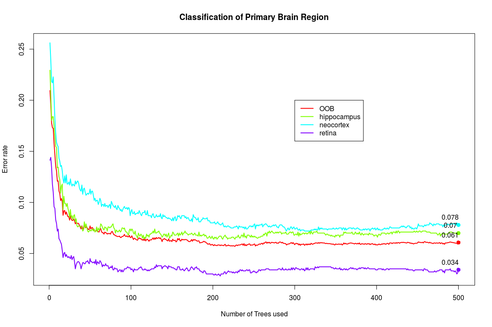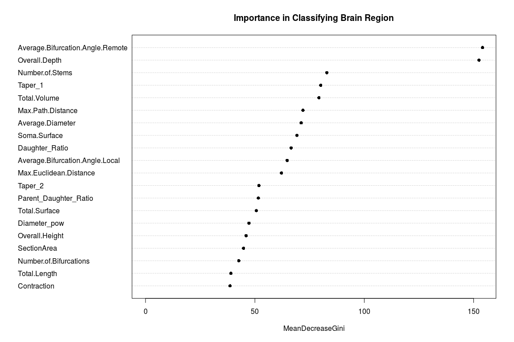

The overall error rate is about 5.27%. Neocortex seems to be the most
difficult to classify. It contains the most number of observations, so
perhaps a simple random sample of 1000 is not giving a representative
sample. The most important variables in classifying the
`Primary.Brain.Region` are `Average.Bifurcation.Angle.Remote` and
`Overall.Depth` The following pie chart shows the percentage of neurons
from a secondary brain region when they come from the neocortex:

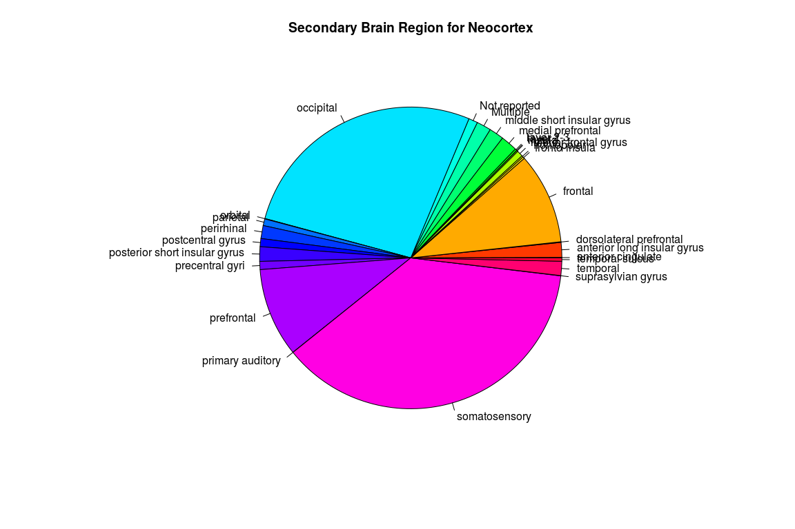

Many secondary brain regions are underrepresented...

Primary Cell Class
------------------

Again, we see what there is to work with when looking at
`Primary.Cell.Class` from NeuroMorpho:

    summary(master$Primary.Cell.Class)

    ##      interneuron     Not reported   principal cell sensory receptor 
    ##             5267              137            13210               84

Most are either principal cells or interneurons. The not reported (which
are all rats) and sensory receptor observations will be removed, and
then a random forest will try to classify the two remaining cell
classes. A random sample of 3000 is taken from each of `interneuron` and
`principal cell`.

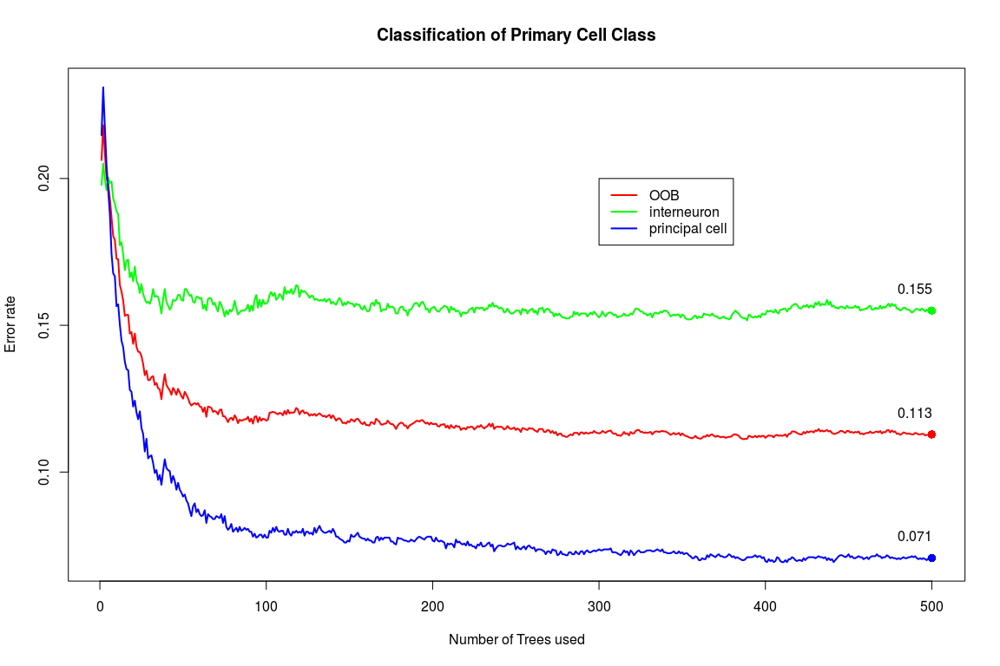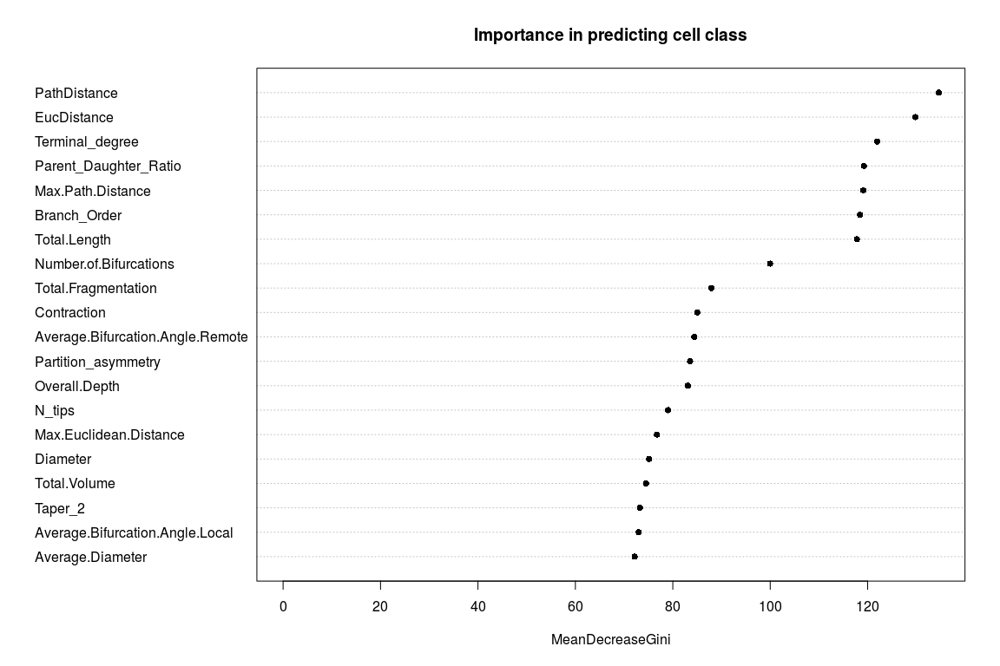

The overall error rate is much higher than with `Primary.Brain.Region`
(around 11.72%). The interneuron error rate is at 15.5%. One way to
lower this (again) might be to try a better sampling approach. The
important variables here are different than for `Primary.Brain.Region`.
Variables such as `PathDistance`, `EucDistance`, and `Terminal_degree`
are important in classifying `Primary.Cell.Class`. The pie charts below
show `Secondary.Cell.Class` for the entire set of interneurons and
principal cells.

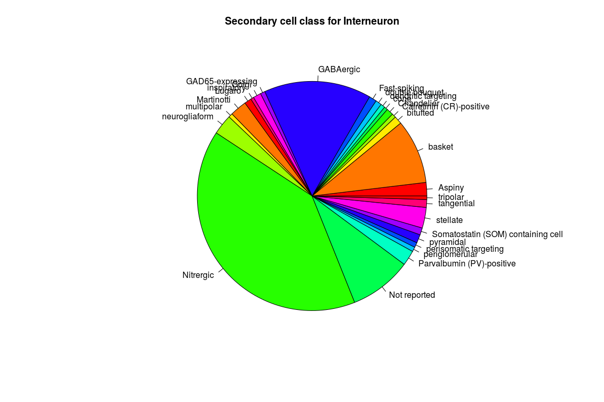

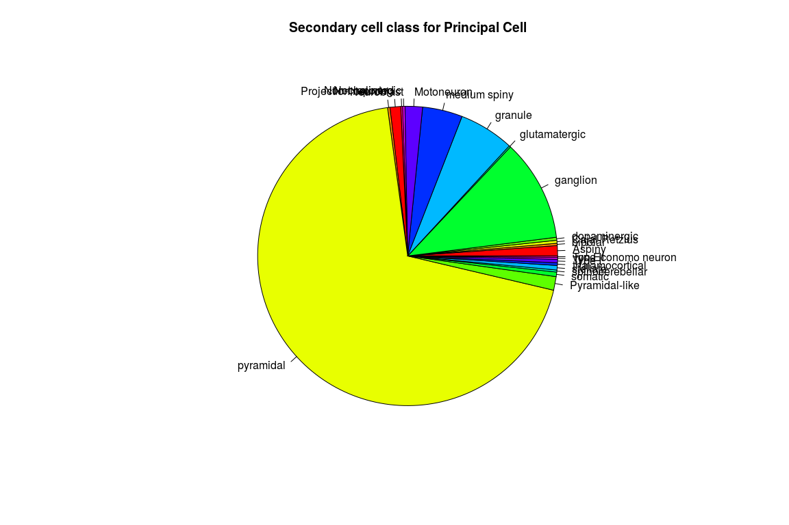
